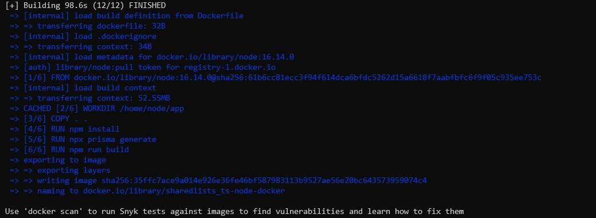
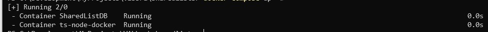
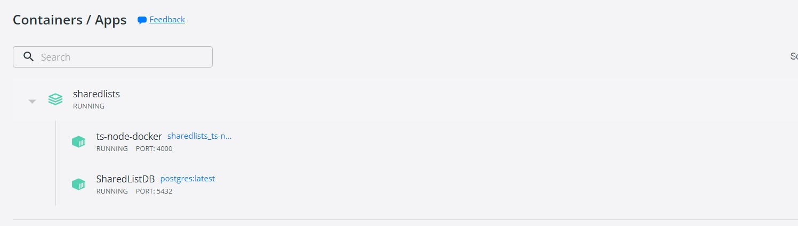
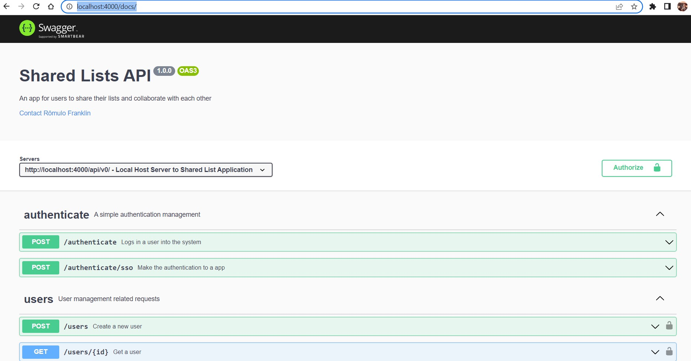
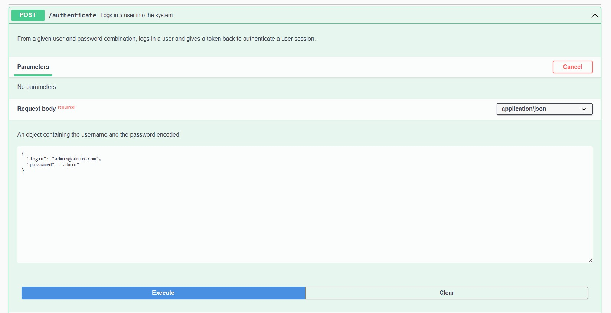
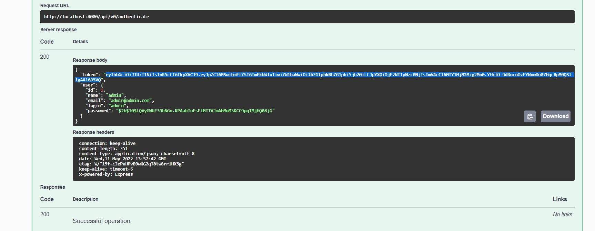
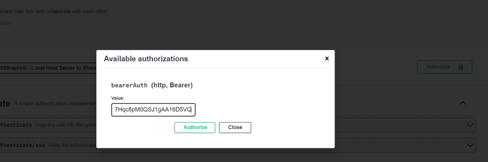

# Shared List

An app for users to share their lists and collaborate with each other.

> Por favor, essa é apenas uma aplicação teste. Desconsidere certos cuidos que normalmente se teria ao compartilhar uma aplicação, como informações the dotenv, teste e documentação de código.
> Minha unica preocupação aqui foi implementar as funcionalidades solicitadas e tentar atransmiti-las a esse repositório de uma maneira que tornasse simples a execução da aplicação.
> 

> Please, this is just a test application. Disregard certain precautions you would normally take when sharing an application, such as the dotenv information, testing and code documentation.
> My only concern here was to implement the requested features and try to transmit them to this repository in a way that would make the application execution simple.

# Some **Used Features**

---

- Typescript
- NodeJS 16.14.0
- Overnightjs
- Express
- Prisma
- jsonwebtoken
- bcrypt
- dotenv
- Swagger-ui

# Project Setup

---

> docker build . -t sharedlists_ts-node-docker
> 

> docker-compose up -d
> 

After that, you’ll be able to see the projects running at your Docker Desktop:

When the app runs by, at first time, it will create a admin user able to start the interaction with the system, to create new users, new lists, and items. 

With the Shared List App running, access the project documentation in:

[[http://localhost:](http://localhost:4000/docs/)4000/docs/](https://www.notion.so/http-localhost-4000-docs-0f21d9df8c6345e1a95bf14078c1c090)

To start the operation, please, make the /authenticate POST Request to authenticates with the system:

Once done, copy the token returned and past to authorize field in the page. It will use this token to make any other request that you makes.

**Below, I provide a very simple video of the application running:**

[https://www.youtube.com/watch?v=zIZ-FmmEWyw](https://www.youtube.com/watch?v=l644ArNAu4o)